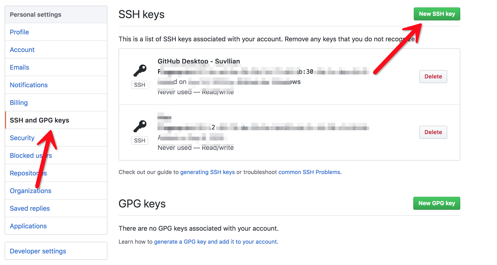

## 配置密钥
首先在本地生成一个SSH Key，输入命令：

```
ssh-keygen -t rsa -b 4096 -C "suvlliansong@163.com"
```

回车之后会出现几条确认信息，其中有：

```
Enter a file in which to save the key (/Users/demon/.ssh/id_rsa): [Press enter]
```

输入私钥的存储位置，默认是/Users/demon/.ssh/id_sra。如果只使用一个Git账户，使用默认位置即可，如果创建多个账户，第二次及以后的私钥需要重命名。  

/Users/demon是当前用户的根目录，也就是~/.ssh/id_sra和~/.ssh/id_sra.pub是系统默认获取密钥的位置。当你用SSH方式访问Github的时候，默认会用这个路径获取密钥，所以不要轻易修改文件路径。

例如我输入的是：

```
/Users/demon/.ssh/id_ras_suvllian
```

然后，系统会让你设置Key的密码：

```
Enter passphrase (empty for no passphrase): [Type a passphrase]
Enter same passphrase again: [Type passphrase again]
```

可以输入密码，也可以直接回车。如果输入了密码，那在你使用SSH Key登陆Github的时候，需要输入密码。  
此时，SSH Key已经生成完成，`.ssh`文件夹下会生成两个文件：id_rsa和id_rsa.pub，分别是私钥和公钥。

现在需要做的就是把id_rsa.pub的公钥配置到Github服务器中。


添加完SSH Key后就已经完成了所有配置。
这个时候git clone下载一个私有仓库，再将代码push到远程仓库，就不用再输入任何账户密码了。
如果你只需要配置一个Git账户，工作到此结束！

## 配置config
如果需要配置多账户的话，重复执行上述操作，注意要重新输入SSH key的名称。

这时候有个问题：当我们使用git命令时，默认使用~/.ssh/id_rsa，新建的key如何使用？   
这时候就需要配置一个config文件。

在~/.ssh/config文件中写入：
```
Host github
    HostName github.com
    User suvllian
    IdentityFile ~/.ssh/id_rsa_suvllian
Host github-default
    HostName gitlab.XXX.com
    User qingsong.sqs
    IdentityFile ~/.ssh/id_rsa
```


## 代码仓库配置user信息