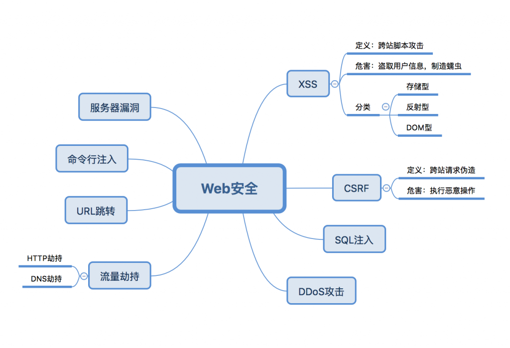

# Web安全

> Web安全对Web开发者来说是要需要掌握的非常重要的理论知识，在编码设计的过程中要考虑到安全问题。

下面我画了一个思维导图，罗列了常见的Web安全问题，在下面的内容中也作出了详细介绍。

## 一、XSS

首先是最常见的XSS漏洞，XSS(Cross Site Script)，跨站脚本攻击，因为缩写和CSS(cascading Style Sheets)重叠，所以称为XSS。

**原理**：攻击者在页面中插入可执行的恶意脚本代码，其他用户浏览页面时，脚本代码就会执行，从而达到盗取用户信息或其他侵犯用户安全隐私的目的。

**主要危害**：Cookie窃取、会话劫持、钓鱼诈骗、网页挂马等。

**分类**：反射型XSS、存储型XSS、DOM XSS。

### 1.反射型XSS
一般通过将恶意脚本代码作为参数放在URL中传递，当URL被奠基石，恶意代码就会被解析执行。

反射型XSS特征：
* 不需要经过服务器存储，直接通过HTTP请求完成攻击，获取用户数据。
* 需要被攻击者点击触发。

防范方法：
* Web页面渲染的内容和数据都来自服务器。
* 不要从URL、document.referrer、document.forms等API中获取数据直接渲染。
* 不要使用eval、document.write\document.writeln等可以执行字符串的方法。
* 对涉及DOM渲染的方法传入的字符串参数进行**转义处理**。

存储型XSS
会将攻击代码发送到服务器中。
场景：留言板，获取受害者cookie信息发送到攻击者服务器。

### 2.DOM型XSS

防范：
1、永远不要相信用户的输入，在用户输入的时候对字符串进行转义或者过滤，在输出字符串的时候也进行转义和过滤。

2、cookie设置为httpOnly，js不能获取和操作cookie。

## CSRF
跨站请求伪造

防范：
1、校验http refer  
2、使用token校验请求。

## DNS劫持